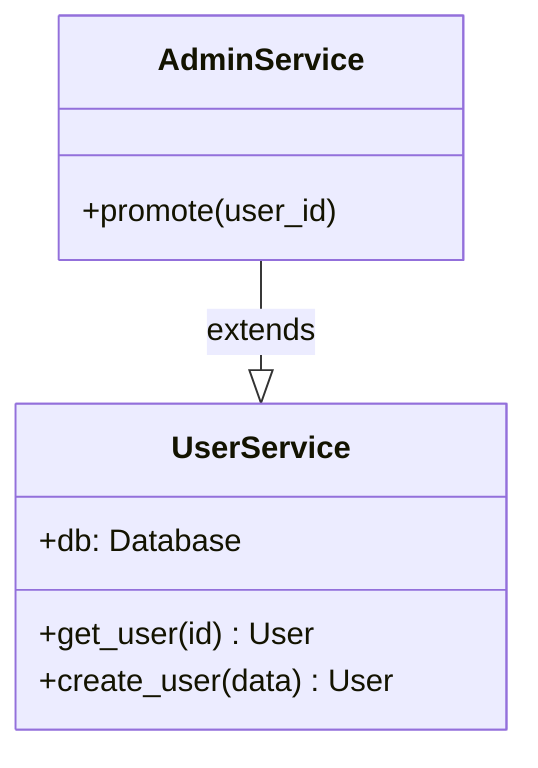
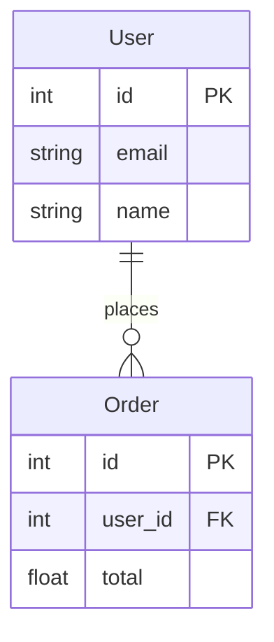
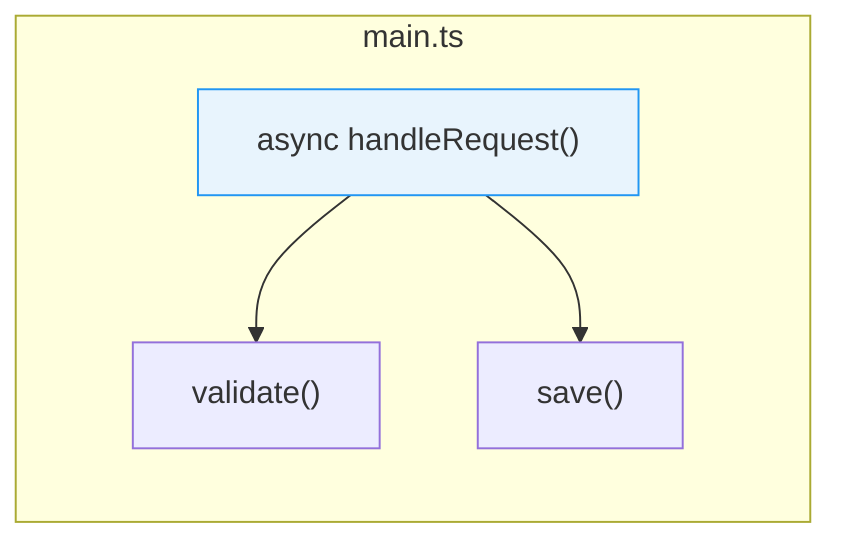

<div align="center">
  

  <br/>

  [](https://python.org)
  [](https://github.com/yashrandive11/spartastruct)
  [](LICENSE)
  [](tests/)
  [](https://github.com/yashrandive11/spartastruct)
  [](https://docs.litellm.ai/)

  <br/>

  **Point SpartaStruct at any Python, JavaScript, or TypeScript project and get 11 architecture diagrams in under a minute.**  
  PDF and PNG export. Works offline. Optionally enriched by any LLM.

</div>

---

## ⚡ Quick Start

> **Estimated time: 2 minutes**

**Step 1 — Install the dependencies**

```bash
# Install SpartaStruct
pip install spartastruct

# Install Node.js (https://nodejs.org) — that's it.
# SpartaStruct uses npx to run the Mermaid CLI automatically.
```

**Step 2 — Run it on your project**

```bash
spartastruct analyze /path/to/your/project --no-llm
```

That's it. Eleven PDF files appear in a `spartadocs/` folder inside your project.

```
your-project/
└── spartadocs/
    ├── class_diagram.pdf      ← all your classes and how they relate
    ├── er_diagram.pdf         ← database tables and relationships
    ├── dfd.pdf                ← HTTP routes → services → database
    ├── flowchart.pdf          ← app logic and entry points
    ├── function_graph.pdf     ← which functions call which
    ├── module_graph.pdf       ← which files import which
    ├── sequence_diagram.pdf   ← how components interact at runtime
    ├── state_diagram.pdf      ← state machines and transitions
    ├── api_map.pdf            ← all HTTP routes grouped by resource
    ├── component_map.pdf      ← service layers and dependencies
    └── event_flow.pdf         ← async tasks and event/message flow
```

**Step 3 — Add LLM enrichment (optional)**

```bash
spartastruct init                                   # creates ~/.spartastruct/config.toml
spartastruct config --api-key anthropic YOUR_KEY    # store your API key
spartastruct analyze /path/to/your/project          # runs with LLM enrichment
```

The LLM improves diagram labels, adds descriptions, and connects the dots between related components.

---

## How It Works

<div align="center">
  
</div>

<br/>

SpartaStruct works in four stages:

1. **Walk** — finds every source file in your project, skipping `node_modules`, `venv`, `__pycache__`, build artifacts, etc.
2. **Analyze** — parses each file statically (no code is executed). Extracts classes, functions, routes, database models, imports, and call relationships.
3. **Enrich** (optional) — sends the analysis to an LLM, which improves the diagram and adds a plain-English description.
4. **Export** — converts each Mermaid diagram to a PDF or PNG using the `mmdc` CLI tool.

---

## The 11 Diagrams Explained

Each diagram answers a different question about your codebase.

<details>
<summary><strong>📦 Class Diagram</strong> — "What classes exist and how do they relate?"</summary>

<br/>

Shows every class in your project, its attributes (variables), its methods (functions), and whether it inherits from another class.



**Useful for:** Understanding the shape of your code, onboarding new developers, spotting classes that do too much.

</details>

<details>
<summary><strong>🗄️ ER Diagram</strong> — "What does the database look like?"</summary>

<br/>

Shows your database tables (ORM models) and the relationships between them — one-to-many, many-to-many, foreign keys, etc.

Supports: **SQLAlchemy**, **Django ORM**, **Tortoise ORM**, **Peewee**, **TypeORM**, **Sequelize**, **Mongoose**, **Prisma**.



**Useful for:** Database design reviews, writing migrations, explaining the data model to non-engineers.

</details>

<details>
<summary><strong>🌊 Data Flow Diagram (DFD)</strong> — "How does data move through the app?"</summary>

<br/>

Traces the path from an HTTP request → controller/handler → service layer → database. Particularly useful for API-heavy projects.

Supports: **FastAPI**, **Flask**, **Django**, **Express**, **NestJS**.

**Useful for:** Security reviews, debugging unexpected behaviour, understanding which routes hit which tables.

</details>

<details>
<summary><strong>🔄 Flowchart</strong> — "What does the app actually do step by step?"</summary>

<br/>

A top-down flow diagram starting from your entry points (`main()`, `run()`, CLI handlers, index files, etc.) showing the sequence of processing.

**Useful for:** Explaining app logic to stakeholders, spotting dead code, documenting workflows.

</details>

<details>
<summary><strong>🕸️ Function Graph</strong> — "Which functions call which?"</summary>

<br/>

A left-to-right call graph grouping functions by file. Async functions are highlighted in blue. Entry-point functions are highlighted in yellow.



> Edges are automatically deduplicated and capped at 8 per node to keep the diagram readable.

**Useful for:** Finding tightly-coupled functions, understanding call depth, refactoring planning.

</details>

<details>
<summary><strong>🗺️ Module Graph</strong> — "Which files import which?"</summary>

<br/>

A top-down dependency graph of your project's files. Local imports (your own code) are shown with solid lines. Third-party imports are shown with dashed lines.

**Useful for:** Identifying circular imports, understanding coupling between modules, planning a refactor.

</details>

<details>
<summary><strong>🔀 Sequence Diagram</strong> — "How do components interact at runtime?"</summary>

<br/>

Traces the call sequence from an HTTP request through route handlers, service methods, repository calls, and database queries. Shows participant lifelines and message arrows.

**Useful for:** Code reviews, debugging request flows, onboarding new developers to understand runtime behaviour.

</details>

<details>
<summary><strong>🔄 State Diagram</strong> — "What states can this object be in?"</summary>

<br/>

Detects classes with `status`, `state`, or `stage` attributes and methods that trigger transitions (approve, cancel, complete, etc.). Renders a nested state machine per class, falling back to a generic request lifecycle.

**Useful for:** Understanding order/payment/workflow states, designing new state machines, reviewing business logic.

</details>

<details>
<summary><strong>🗂️ API Endpoint Map</strong> — "What routes does this app expose?"</summary>

<br/>

Groups all HTTP routes by resource (first path segment). Each route shows its method, path, and handler name. Methods are colour-coded: GET (green), POST (blue), PUT/PATCH (yellow), DELETE (red).

**Useful for:** API reviews, writing API documentation, spotting missing or duplicate endpoints.

</details>

<details>
<summary><strong>🏗️ Component Map</strong> — "What are the logical layers of this app?"</summary>

<br/>

Groups classes by naming convention into Controllers, Services, Repositories, Models, and Utils layers. Draws dependency arrows between layers and shows detected external frameworks.

**Useful for:** Architecture reviews, onboarding, identifying layering violations (e.g. a Controller directly accessing a Repository).

</details>

<details>
<summary><strong>📨 Event & Message Flow</strong> — "How does async messaging work?"</summary>

<br/>

Detects Celery tasks (`@shared_task`, `@app.task`), event emitters (`emit()`, `publish()`, `dispatch()`), and async functions. Shows producers, consumers, and the message broker/bus between them.

**Useful for:** Understanding background job pipelines, debugging message flow, reviewing Celery task architecture.

</details>

---

## Full CLI Reference

### `spartastruct analyze [PATH]`

Analyzes a project and writes PDFs.

```bash
spartastruct analyze .                          # analyze current directory
spartastruct analyze /path/to/project           # analyze a specific path
spartastruct analyze . --no-llm                 # skip LLM (fast, offline)
spartastruct analyze . --model openai/gpt-4o    # use a different LLM
spartastruct analyze . --output ./my-docs       # write PDFs to a custom folder
spartastruct analyze . --format png             # export as PNG (transparent, 3× scale)
spartastruct analyze . --format both            # export PDF and PNG
```

| Flag | Default | What it does |
|------|---------|-------------|
| `--no-llm` | off | Skip LLM enrichment entirely. Static diagrams only. Fully offline. |
| `--model MODEL` | from config | Use a different LLM model just for this run. Uses litellm format: `provider/model`. |
| `--output DIR` | `spartadocs` | Write PDFs/PNGs here instead of the default `spartadocs/` folder. |
| `--format FORMAT` | `pdf` | Output format: `pdf`, `png` (transparent background, 3× scale), or `both`. |

---

### `spartastruct init`

Creates the config file at `~/.spartastruct/config.toml` with default settings. Run this once before using LLM features.

```bash
spartastruct init
```

---

### `spartastruct config`

View or update your settings.

```bash
spartastruct config --show                              # print current settings
spartastruct config --model anthropic/claude-opus-4-7  # change the default model
spartastruct config --output-dir ./architecture-docs    # change the default output folder
spartastruct config --api-key anthropic sk-ant-...      # save an API key
spartastruct config --api-key openai sk-...             # save multiple keys
```

| Flag | What it does |
|------|-------------|
| `--show` | Print your current config. Use this to verify settings. |
| `--model MODEL` | Set the default LLM model. Accepts any litellm-format string. |
| `--output-dir DIR` | Set where PDFs are saved by default. |
| `--api-key PROVIDER KEY` | Save an API key for a provider. Provider name must match the litellm prefix. |

---

## LLM Setup

SpartaStruct uses [litellm](https://docs.litellm.ai/) under the hood, which means it works with almost any LLM provider.

### Supported Providers

| Provider | Config key | Model format |
|----------|-----------|-------------|
| Anthropic | `anthropic` | `anthropic/claude-haiku-4-5-20251001` |
| OpenAI | `openai` | `openai/gpt-4o` |
| Google Gemini | `gemini` | `gemini/gemini-2.0-flash` |
| Groq | `groq` | `groq/llama-3.1-70b-versatile` |
| Mistral | `mistral` | `mistral/mistral-large-latest` |
| Cohere | `cohere` | `cohere/command-r-plus` |
| Together AI | `together` | `together/meta-llama/Meta-Llama-3.1-70B-Instruct-Turbo` |
| Ollama (local) | `ollama` | `ollama/llama3.2` |

**Default model:** `anthropic/claude-haiku-4-5-20251001` (fast and cheap)

### Setting Up Anthropic (example)

```bash
# 1. Get your API key from https://console.anthropic.com
# 2. Store it
spartastruct config --api-key anthropic sk-ant-...
# 3. Verify
spartastruct config --show
# 4. Run
spartastruct analyze /path/to/project
```

### Using Ollama (fully local, no API key needed)

```bash
# Install Ollama from https://ollama.com, then pull a model
ollama pull llama3.2

# Tell SpartaStruct to use it
spartastruct config --model ollama/llama3.2

# Run — no internet connection needed
spartastruct analyze /path/to/project
```

---

## Supported Languages

SpartaStruct auto-detects your project's primary language and picks the right analyzer. For polyglot projects (e.g. an API backend with a TypeScript frontend in the same repo), both analyzers run and results are merged into a single set of diagrams.

| Language | Extensions | Analyzer |
|----------|-----------|---------|
| Python | `.py` | AST-based — classes, functions, routes, ORM models, imports |
| JavaScript | `.js`, `.jsx` | Regex-based — classes, functions, Express routes, imports |
| TypeScript | `.ts`, `.tsx` | Regex-based — classes, interfaces, functions, NestJS routes, imports |

**Detected JS/TS frameworks:** Express, NestJS, Next.js, React, Vue, Angular, Nuxt, TypeORM, Sequelize, Mongoose, Prisma, GraphQL, Apollo, Socket.IO, Axios, Jest, Vitest, RxJS

**How auto-detection works:** SpartaStruct counts source files by language. Single-language projects use the matching analyzer. Mixed projects run both and merge the results.

---

## Supported Frameworks

SpartaStruct auto-detects which frameworks your project uses and includes that in the analysis.

| Category | Frameworks |
|----------|-----------|
| **Web (Python)** | FastAPI, Flask, Django |
| **Web (JS/TS)** | Express, NestJS, Next.js |
| **Database / ORM** | SQLAlchemy, Django ORM, Tortoise ORM, Peewee, Alembic, TypeORM, Sequelize, Mongoose, Prisma |
| **Task Queues** | Celery |
| **Validation** | Pydantic |
| **Testing** | Pytest, Jest, Vitest |
| **HTTP Clients** | Requests, HTTPX, Axios |
| **Data Science** | NumPy, Pandas, PyTorch, TensorFlow |
| **Frontend** | React, Vue, Angular, Nuxt |

Detection is automatic — you don't need to tell SpartaStruct which frameworks you use.

---

## Requirements

| Tool | Version | Install |
|------|---------|---------|
| Python | 3.10+ | [python.org](https://python.org) |
| Node.js | 18+ | [nodejs.org](https://nodejs.org) |

> Node.js is only needed for PDF/PNG export. SpartaStruct uses `npx` to run the Mermaid CLI automatically — no separate install step required. The analysis and diagram generation work without Node.js at all.

---

## Config File Reference

The config lives at `~/.spartastruct/config.toml`. You can edit it directly or use `spartastruct config`.

```toml
model = "anthropic/claude-haiku-4-5-20251001"
output_dir = "spartadocs"

[api_keys]
anthropic = "sk-ant-..."
openai = "sk-..."
```

---

## Project Structure

```
spartastruct/
├── analyzer/
│   ├── base.py              # data types: FileResult, ClassInfo, FunctionInfo, etc.
│   ├── python_analyzer.py   # AST-based analyzer for Python
│   └── js_analyzer.py       # regex-based analyzer for JavaScript / TypeScript
├── diagrams/
│   ├── class_diagram.py     # classDiagram generator
│   ├── er_diagram.py        # erDiagram generator
│   ├── dfd.py               # data flow diagram generator
│   ├── flowchart.py         # flowchart generator
│   ├── function_graph.py    # function call graph generator
│   ├── module_graph.py      # module dependency graph generator
│   ├── sequence_diagram.py  # sequenceDiagram generator
│   ├── state_diagram.py     # stateDiagram-v2 generator
│   ├── api_map.py           # API endpoint map generator
│   ├── component_map.py     # component / service layer map generator
│   └── event_flow.py        # event & message flow generator
├── llm/
│   ├── client.py            # litellm wrapper, failure tracking, retry logic
│   └── prompts.py           # system prompts per diagram type
├── renderer/
│   ├── markdown_renderer.py # assembles sections from diagram results
│   └── pdf_exporter.py      # calls mmdc to convert Mermaid → PDF/PNG
├── utils/
│   ├── file_walker.py       # finds source files, respects ignore patterns
│   └── framework_detector.py# detects frameworks from imports
├── templates/
│   └── structure.md.j2      # Jinja2 template for markdown layout
├── config.py                # TOML config load/save
└── cli.py                   # Click CLI (analyze, init, config)
```

---

## Contributing

```bash
git clone https://github.com/yashrandive11/spartastruct
cd spartastruct
pip install -e ".[dev]"
pytest
```

---

<div align="center">
  <sub>Built with Python · Mermaid.js · litellm · Rich · Click</sub>
</div>
